# AI Patient Check-In Kiosk

**Walk in, look at the camera, and you're checked in.** A self-service kiosk for clinics: patients check in by face scan or with their details, register, sign intake forms and book appointments in four languages. Staff get a live dashboard with the waiting room, schedule, patient records and a full audit log.

The face recognition runs **on the clinic's own computer**. No patient data is sent to any cloud service.

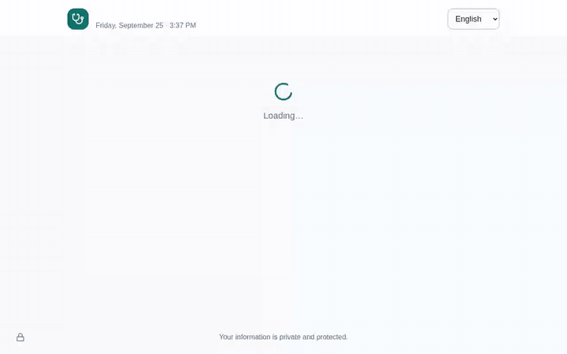

▶️ **[Watch the full 3-minute demo video](docs/demo/demo.mp4)**. It covers registration, booking, face check-in, intake forms, safety checks and the staff dashboard.

> The demo uses fictional patient data. Faces are blurred in the video and screenshots for privacy; the real app shows the live camera.

---

## Contents
- [What it does](#what-it-does)
- [Screenshots](#screenshots)
- [How it works](#how-it-works)
- [Run it yourself](#run-it-yourself)
- [Security & privacy](#security--privacy)
- [What we built](#what-we-built)
- [Roadmap](#roadmap)
- [Team](#team)

## What it does

### For patients (the kiosk)
| | |
| --- | --- |
| 🙂 **Face check-in** | Look at the camera. After a 3-second countdown, the AI recognises returning patients and asks *"Is this you, Maria L.?"* before showing anything. |
| 🔎 **No camera? No problem** | Check in with last name, date of birth and the last 4 digits of your phone. |
| 📝 **Registration** | Three short steps: details, insurance (or self-pay), and optional face enrollment with explicit consent. Duplicates are detected. |
| ✍️ **Intake forms** | Privacy notice, treatment consent and financial responsibility, signed with a finger. Valid for one year. |
| 🚪 **Check-in & routing** | Only for today's appointment. Tells the patient which room to go to and how many people are ahead. |
| 📅 **Booking** | Department → doctor → day → live available times → reason. Double-booking is impossible. Upcoming visits can be cancelled. |
| 🌍 **4 languages** | English, Español, Français, 中文. |
| 🔒 **Privacy reset** | The screen clears itself after inactivity and after every visit, so the next person never sees your data. |

### For staff (the dashboard)
| | |
| --- | --- |
| 🏥 **Today** | Live waiting room with wait times, today's schedule, and counts: scheduled, waiting, completed, no-shows, average visit length. |
| 🔁 **Appointment workflow** | Check in, complete visit, no-show, cancel, restore: one click each. |
| 👤 **Patient records** | Search; open a record for photo, contact, insurance, (simulated) EHR data, visit history and signed forms. |
| 🗑️ **Privacy requests** | Delete a patient's face data only, or the whole patient, permanently. |
| 📜 **Audit log** | Every sign-in (including failures), face match, lookup, check-in, record view and deletion, with time and IP address. |
| 🔐 **Secure by default** | The default password must be changed. Sign-in locks after repeated failures, and staff are signed out automatically after 15 minutes idle. |

## Screenshots

| Welcome (4 languages) | Three ways in |
| --- | --- |
| 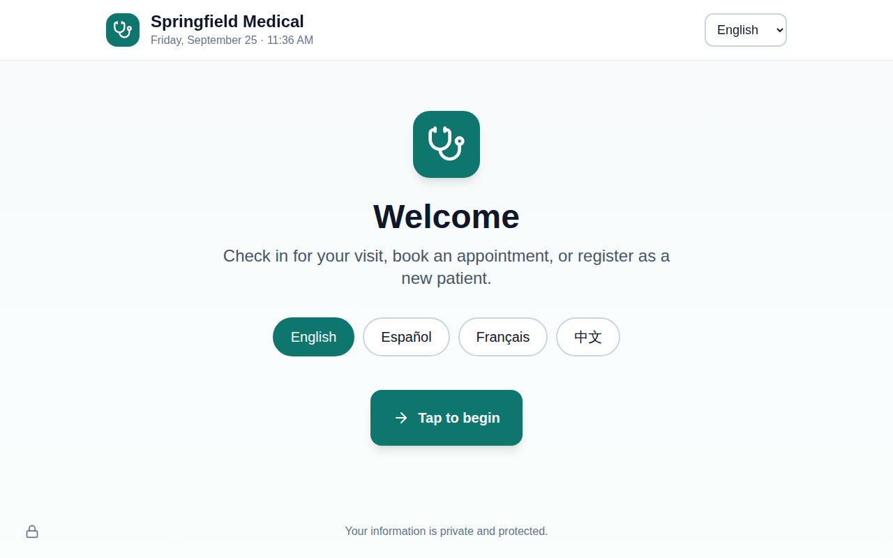 | 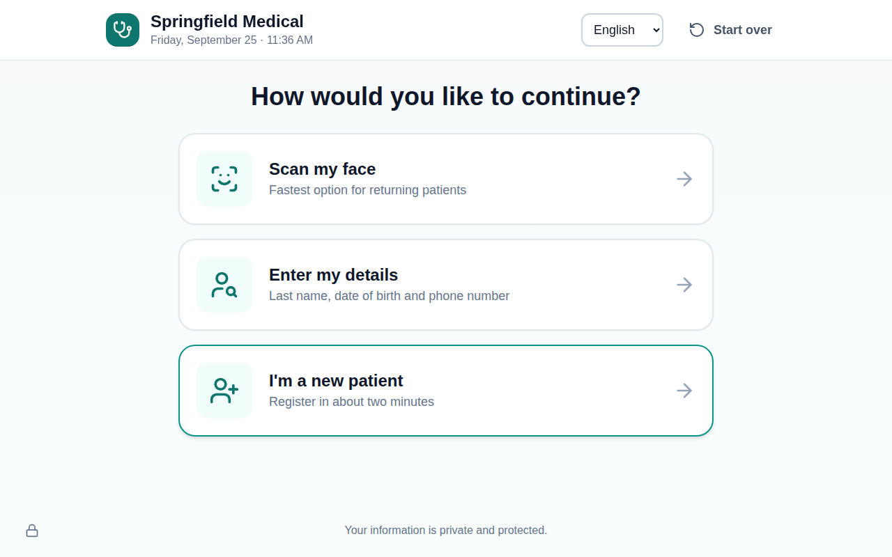 |
| **Registration with validation** | **Face enrollment needs consent** |
| 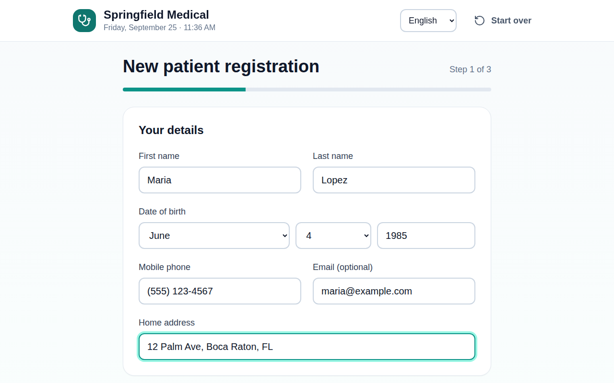 | 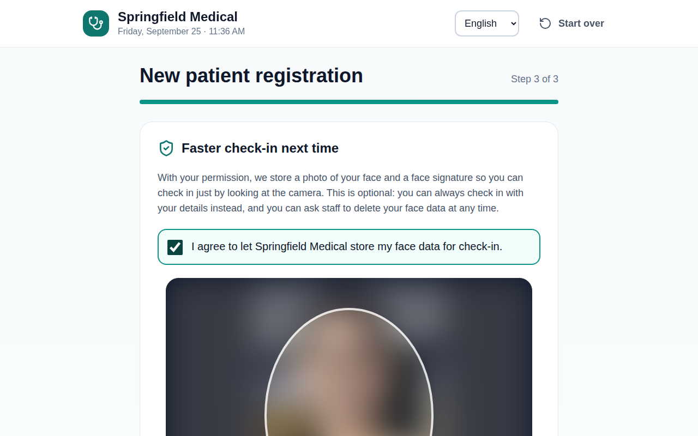 |
| **Face check-in** | **"Is this you?" before showing any data** |
|  | 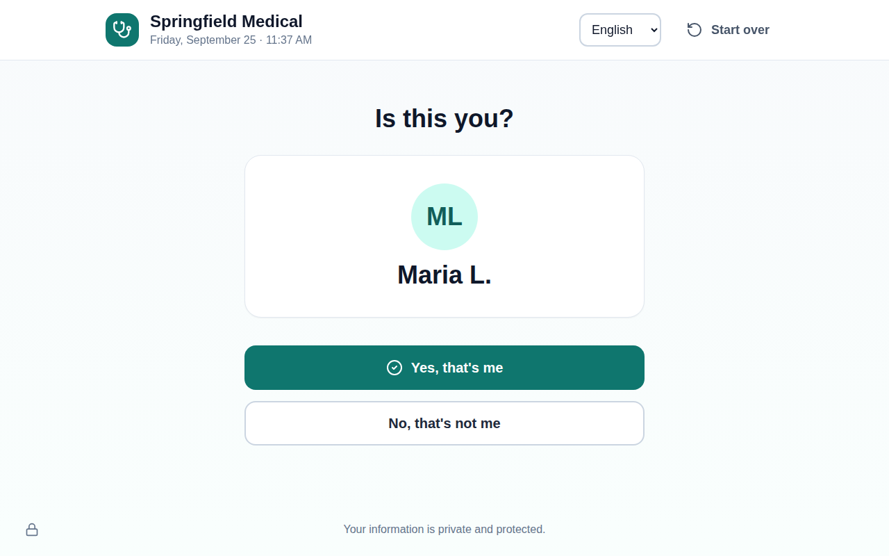 |
| **Patient home: today and upcoming** | **Intake forms signed with a finger** |
| 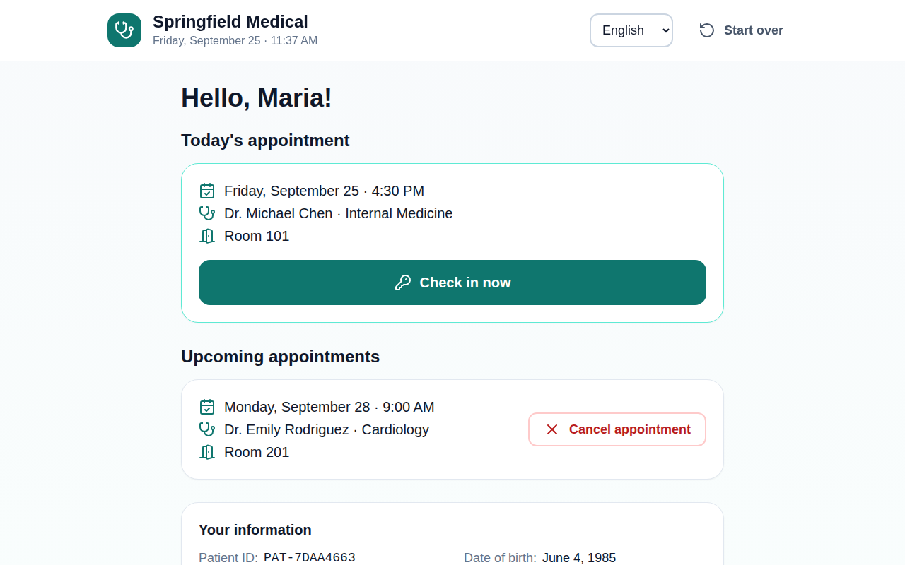 | 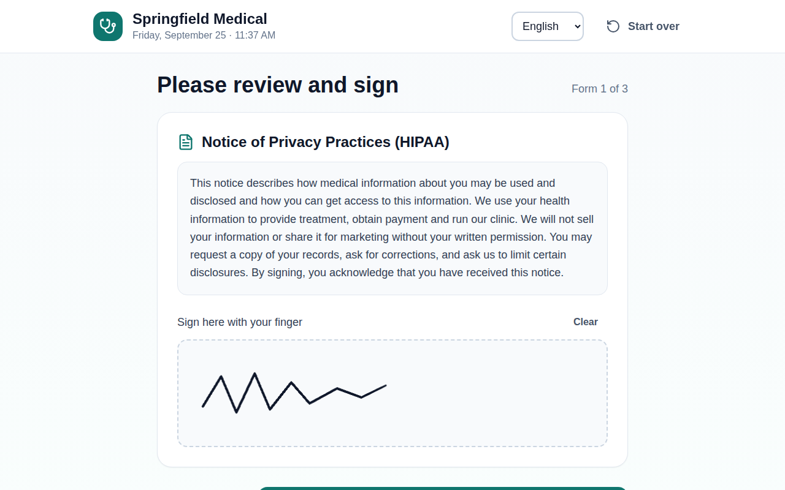 |
| **Checked in: room and queue** | **A stranger is not recognised (Spanish)** |
| 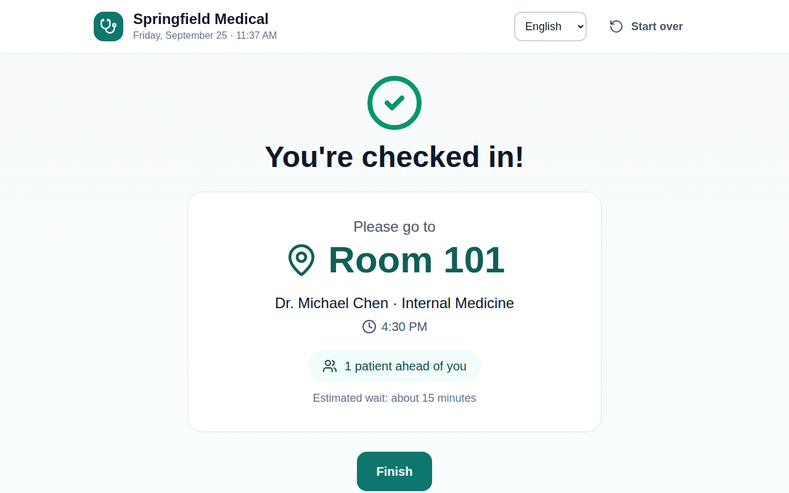 | 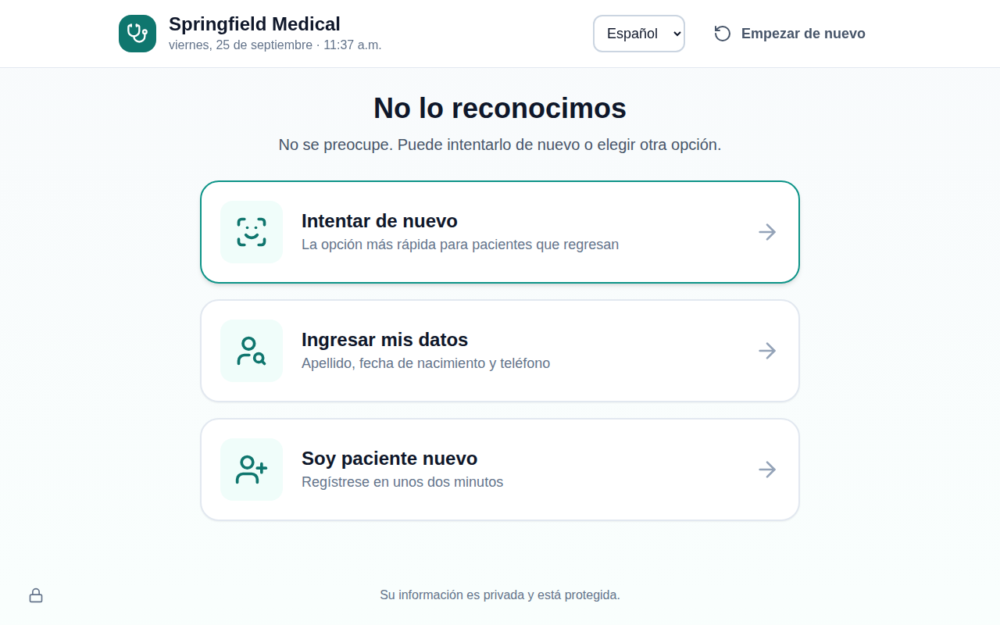 |
| **Booking: only free times** | **Booked** |
| 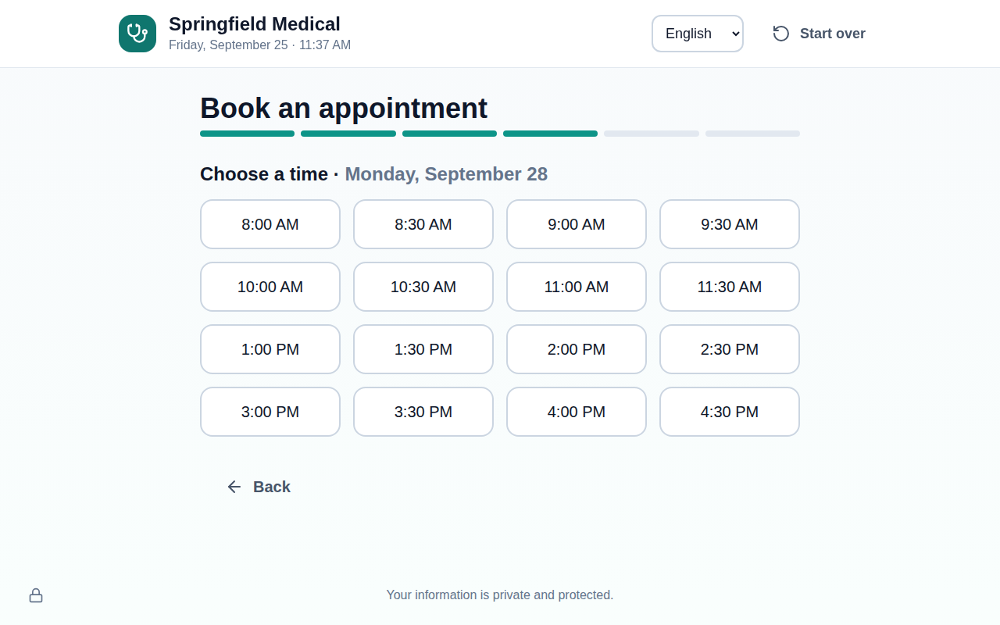 | 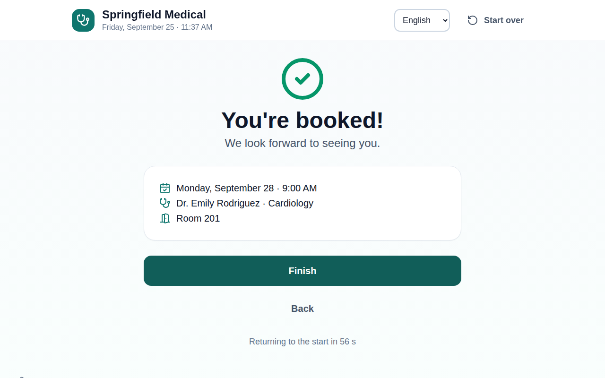 |
| **Staff: live waiting room** | **Staff: patient record** |
| 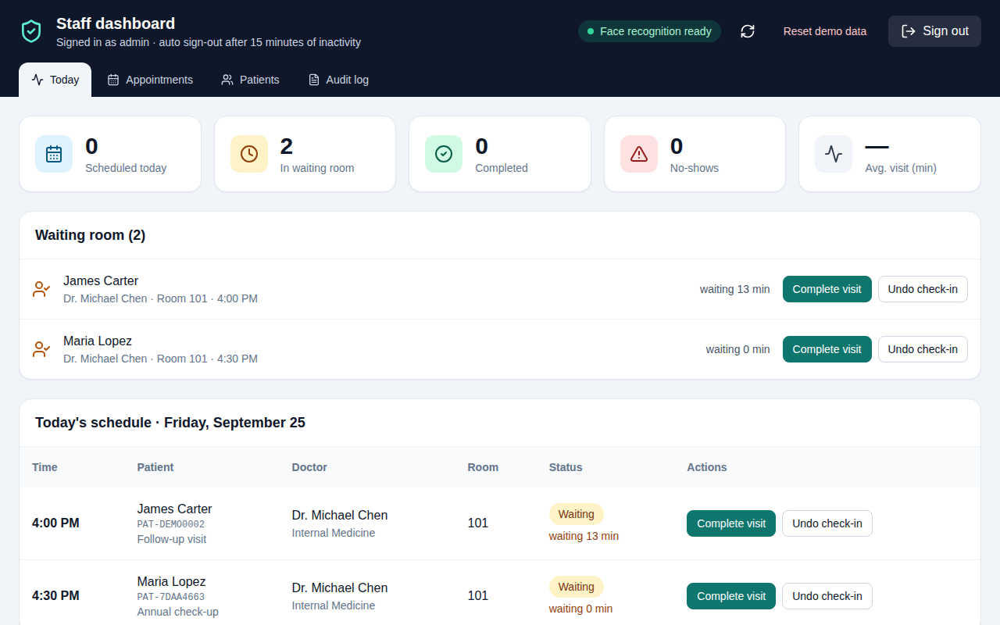 | 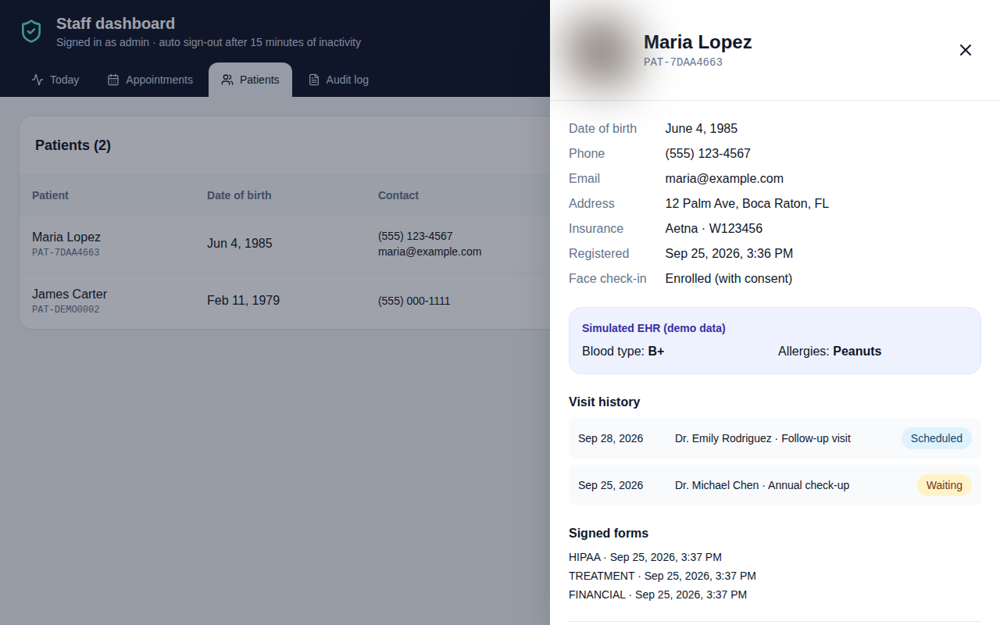 |
| **Staff: audit log** | |
| 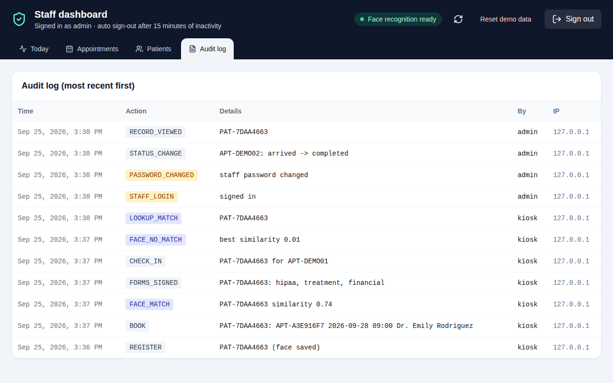 | |

## How it works

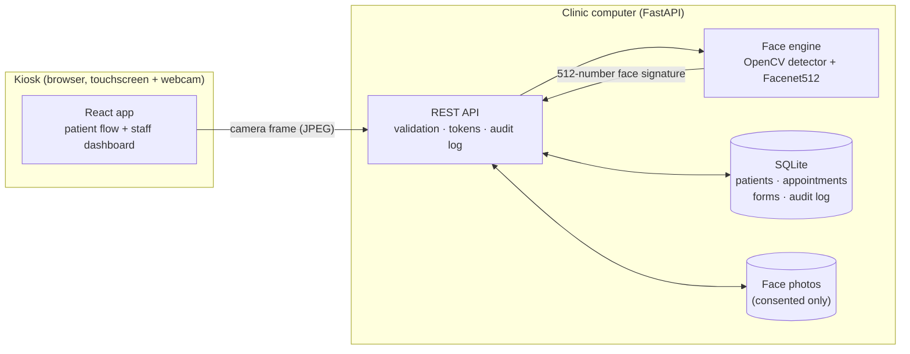

1. The kiosk takes a photo from the webcam and sends it to the local server.
2. The face engine finds the face and turns it into a **512-number face signature** (an embedding). It compares that against the signatures of patients who consented. Two photos of the same person typically score **~0.7+**, different people **< 0.3**, and a match needs **0.5**.
3. On a match, the kiosk receives a **15-minute token that only works for that one patient**, and the patient must confirm it's them.
4. Everything is stored locally in SQLite. Staff endpoints require a signed-in staff token.

**Tech stack:** React 19 · Tailwind CSS · FastAPI · SQLAlchemy · SQLite · DeepFace (Facenet512) · OpenCV · TensorFlow

## Run it yourself

You need **Node.js 18+** and **Python 3.9 – 3.12** (TensorFlow doesn't support newer Python yet).

```bash
git clone https://github.com/Aryanbhagat23/ai-patient-kiosk.git
cd ai-patient-kiosk
```

- **Windows:** double-click `start.bat` (or run `.\start.bat` in PowerShell)
- **macOS / Linux:** `./start.sh`

The first run installs everything and builds the app (several minutes; TensorFlow is large). After that it starts in seconds, and your browser opens at **http://localhost:8000**.

**Staff dashboard:** click the small 🔒 icon at the bottom-left of the kiosk. The first sign-in is `admin` / `password123`, and you'll be asked to choose a new password.

More details (configuration, tests, troubleshooting) are in [`patient-checkin-system/README.md`](patient-checkin-system/README.md).

## Security & privacy

- **Opt-in biometrics:** face data is only stored with explicit consent, and can be deleted at any time. Patients can always use the kiosk without it.
- **No wrong-person leaks:** a face match shows only a first name and initial until the patient confirms.
- **Least privilege:**
  - The kiosk's token only works for the identified patient, for 15 minutes.
  - Staff data requires a signed-in staff token.
  - Photos are only served to signed-in staff.
  - Face signatures are never sent to the browser.
- **Hardened sign-in:**
  - Passwords are hashed with PBKDF2 (200k iterations).
  - Sign-in locks after 5 failures.
  - The default password must be changed.
- **Accountability:** a complete audit log of access and changes.
- **Validation everywhere:** all input is checked on the server, and uploads must be real images within a size limit.

> **Before real patients use it:** host it on HIPAA-compliant infrastructure (with a signed business associate agreement), have the clinic's legal team supply the form wording, and turn on anti-spoofing (`ENABLE_LIVENESS=1`).

## What we built

This started as a prototype. We turned it into a product-quality app:

| Before | After |
| --- | --- |
| Face recognition silently failed for every patient, so everyone was "new" | Fixed. Returning patients are recognised from a different photo (tested end to end) |
| Anyone could read all patient data or wipe the database via the API | Every staff action requires sign-in; the kiosk can only access the identified patient |
| Plain-text admin password | Hashed passwords, forced change of the default, lockout, auto sign-out |
| Checked patients into *any* scheduled appointment, even next month | Check-in only for today's appointment, in the clinic's time zone |
| Patient photos publicly downloadable | Photos only for signed-in staff; face data only with consent |
| Hard to set up (two terminals, path problems) | One command: `start.bat` / `start.sh` |
| No tests for most features | 16 backend tests, 4 UI tests, and a full browser run with real face recognition |

Also new: details lookup, duplicate detection, booking with live availability, appointment cancelling, intake forms, queue position, 4 full translations, inactivity privacy reset, staff dashboard with waiting room, patient records, privacy deletions and audit log.

## Roadmap
- Anti-spoofing on by default (blink / depth check)
- Insurance card scan (OCR) to fill in registration automatically
- Text message when the room is ready
- Real EHR integration over FHIR
- Accessibility: voice guidance and a large-text mode
- Cloud deployment on HIPAA-compliant hosting

## Team
- **Aryan** ([@Aryanbhagat23](https://github.com/Aryanbhagat23))
- [@AnnPhann2204](https://github.com/AnnPhann2204): appointment confirmation, today/upcoming appointments, intake forms
